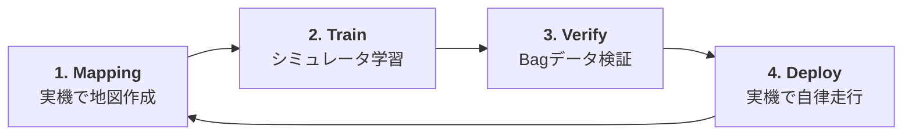

# 🏎️ F1TENTH Jetson ROS 2 Project


[](https://github.com/paypay-S/jetson-ros2-project/actions/workflows/ros2_ci.yml)

F1TENTH 車両を強化学習（Stable Baselines3 / PPO）を用いて Jetson 上で自律走行させるための ROS 2 システムです。
**WSL2 での開発・検証**から、**Jetson 実機でのデプロイ**までを一貫してサポートするように最適化されています。

---

## 🛠️ プロジェクトの構成と役割

このリポジトリは、以下の 2 つの環境で役割を分担して使用します。

| 環境 | 主な役割 | 実行パッケージ |
| :--- | :--- | :--- |
| **WSL2 (PC)** | 開発、コード修正、AI推論のBag検証、RVizによる視覚化 | `f1tenth_rl` (検証用) |
| **Jetson (実機)** | マッピング（SLAM）、実機走行、PWMハードウェア制御 | `f1tenth_mapping`, `f1tenth_rl` |

## 🔄 実機開発サイクル

本プロジェクトは、以下の 4 ステップのサイクルで運用することを想定しています。



---

## 🚀 セットアップ

### 1. 依存関係のインストール
```bash
# WSL2 / Jetson 共通
pip install -r requirements-essential.txt
```

### 2. ビルド
```bash
source /opt/ros/humble/setup.bash  # ROS 2 環境のロード
cd ros2_ws
colcon build --symlink-install
source install/setup.bash
```

---

## 🧭 マッピング（コースの地図作成）

実機 LiDAR で SLAM を行い、その結果を学習用マップとしてエクスポートします。

> [!IMPORTANT]
> **推奨される高精度マッピング手順**
> 
> これまで別々だった起動・保存・統合のフローを統合し、座標ズレのないマッピングを実現する推奨手順です。
>
> 1. **起動:** SSH で `scripts/start_cartographer.sh` を実行。
> 2. **測定:** 車体を手動操作してコースをスキャン。
> 3. **瞬時保存:** マッピングを止めずにキーボードの `1`〜`9` でスナップショットを保存。
> 4. **統合:** 保存後、`scripts/merge_maps.py` で各地図を1つに統合。
>
> 詳細は以下の手順および [マップ管理ガイド](docs/map_management.md) を参照してください。

### Step 1: マッピングの開始 (高度な統合起動)
SSH で Jetson に接続し、以下のスクリプトを実行します。高品質な Cartographer SLAM と、保存機能付きのテレオプマネージャーが起動します。
```bash
cd ~/projects/f1tenth-project
./scripts/start_cartographer.sh
```
起動後、`/scan` トピックの受信が確認されると操作可能になります。

### Step 2: Foxglove Studio による可視化（推奨）
一切画面を繋がなくても、ブラウザから地図作成状況をリアルタイムで確認できます。
1. `https://studio.foxglove.dev` へアクセスし、`Open Connection` を開く。
2. 『Rosbridge』を選択し、`ws://<JetsonのIPアドレス>:9090` を入力して接続。
3. パネルから `Map` (`/map`) や `LaserScan` (`/scan`) を追加。

### Step 3: 手動走行によるスキャン
キーボードの `u i o` 等で車体を操作し、コースをゆっくり 1〜2 周します。
> [!TIP]
> **ループクロージャ**: コースを 1 周してスタート地点に戻ると、スキャンマッチングが働き、地図の歪みが自動で補正されます。

### Step 4: マップの保存 (キーボード操作)
**マッピング中**にキーボードの **`1` 〜 `9`** のいずれかの数字キーを押すと、その瞬間のマップが `maps/session_.../` ディレクトリ内に保存されます。
- 保存時、SLAM プロセスはリセットされないため、続けてマッピングを継続でき、後でそれらを統合することも可能です。
- 作業が完了したら `Ctrl + C` を押すと、全プロセスが安全に終了します。

#### 💡 複数のマップを統合する
セッション中に複数の地図セグメントを保存した場合、それらを統合することができます。詳細は [マップ管理ガイド](docs/map_management.md) を参照してください。
```bash
python3 scripts/merge_maps.py maps/session_XXXX_XXXXXX
```

### Step 5: マップの補正 (オプション)
統合したマップや保存したマップからノイズを除去し、壁を整え、余分な空白をカットします。
```bash
python3 scripts/refine_map.py maps/session_XXXX_XXXXXX/merged_map.yaml
```
補正後のファイル（`_refined.pgm` 等）が生成されます。詳細は [マップ管理ガイド](docs/map_management.md) を参照してください。

---

## 🏎️ 自律走行 (Inference)

学習済みモデル（`.onnx`）を使って実機を走行させます。

### 1. 正規化パラメータの設定
学習時の統計量を `params.yaml` に反映します（エディタで直接編集するか、補助スクリプトを使用）。
```bash
python3 scripts/calibration.py
```

### 2. 走行開始
```bash
ros2 launch f1tenth_rl f1tenth_rl.launch.py \
    model_path:=models/ppo_my_model.onnx \
    fixed_speed_mode:=True \
    fixed_esc_duty:=5600
```
※ `fixed_esc_duty` を上げることで最高速度を調整できます（最初は 5400〜5600 程度を推奨）。

### 3. WSL2 での視覚化検証 (RViz2)
過去の走行データを再生しながら、AI の判断を 3D で確認できます。
```bash
ros2 launch f1tenth_rl f1tenth_rl.launch.py rviz:=True
```
※ 詳細は [WSL2_TEST_GUIDE.md](file:///home/yuta775/projects/jetson-ros2-project/docs/wsl2_test_guide.md) を参照。

---

## 🧪 テスト

### ユニットテスト (ロジック検証)
```bash
pytest ros2_ws/src/f1tenth_rl/test/test_lidar_processor.py
```

## ✨ 主な特徴

- **統合起動システム (Unified Bringup)**: LiDAR、ハードウェア制御、SLAM、Rosbridge を 1 コマンドで一括起動。終了時のゾンビプロセス防止機能付き。
- **環境に依存しない構成**: WSL2 と Jetson の両方で動作。
- **パラメータ管理**: `ros2_ws/src/f1tenth_rl/config/params.yaml` で機体設定や AI パラメータを一括管理。
- **Sim-to-Real 最適化**: 指数移動平均 (EMA) やスルーレート制限により、実機の振動や急激な負荷を抑制。
- **WSL2 検証**: 実機がなくても Bag データを用いた AI 推論の 3D 視覚化が可能。

---

## 🧑‍💻 開発者向け: 統合起動の仕組み

`./scripts/unified_start.sh` および `bringup.launch.py` は以下の構成で動作しています。

- **Python Bridge (`real_bridge.py`)**: 
  キーボード入力を車体命令（Ackermann）に変換しつつ、走行命令から計算した「疑似オドメトリ (`odom -> base_link`)」の TF を発行します。
- **Static TF Publisher**: 
  車体中心から LiDAR までの位置関係 (`base_link -> laser`) を定義し、SLAM が LiDAR の点群を地図上に正しくマッピングできるようにしています。
- **Process Management**: 
  Bash の `trap` 機能と `pkill` を組み合わせることで、Ctrl+C 時にバックグラウンドで動いている ROS 2 ノード群を確実に一括停止させます。

---

## 🛠️ トラブルシューティング

- **[DRY-RUN] と表示される**: 
    - I2C の権限不足 → `sudo chmod 666 /dev/i2c-1`
    - ライブラリ不足 → `setup_jetson.sh` を再実行。
- **緊急停止 (EMERGENCY STOP) が頻発する**: 
    - LiDAR の前方に配線などのノイズがある可能性があります。`params.yaml` の `safety_stop_dist` を調整するか、`rl_driver.py` の crop インデックスを確認してください。
- **RViz2 が表示されない (WSL2)**: 
    - WSL2 の GUI 設定を確認してください（Windows 11 以上推奨）。
- **save_map.sh でマップ保存が失敗する場合**: `start_mapping.sh` が起動中のまま別ターミナルから実行してください（`/map` トピックが必要です）。
- **slam_toolbox が起動しない**: 
    - `ros2 topic echo /scan` でLiDARのデータが届いているか確認してください。
    - **Ubuntu 20.04 をお使いの場合**: `ros-humble-*` はインストールできません。代わりに `ros-foxy-*` をインストールしてください。
      ```bash
      sudo apt install ros-foxy-slam-toolbox ros-foxy-nav2-map-server
      ```
